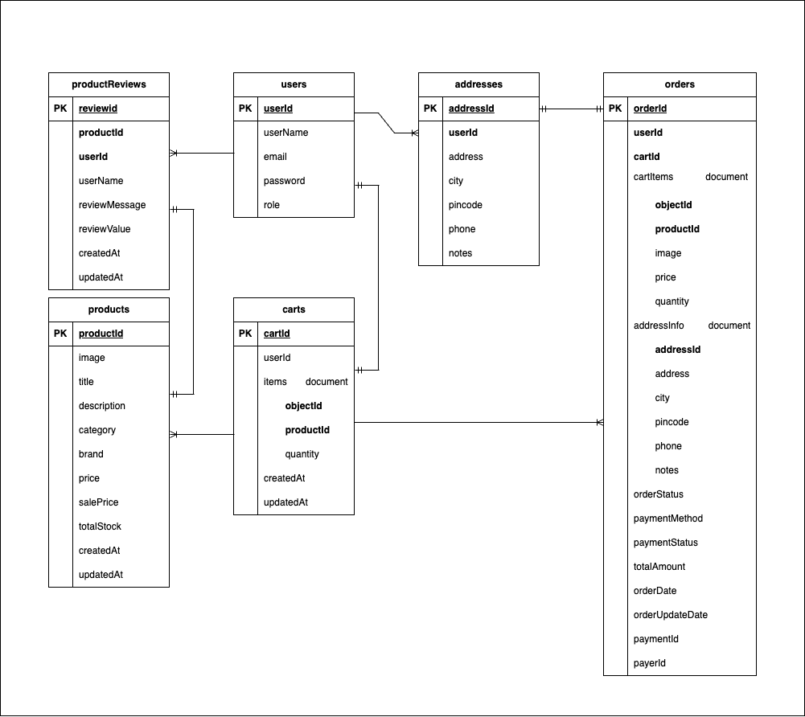

# Phân công nhiệm vụ

## Navigation
1. [Backend](#1-backend)
    - [1.1 Admin + Auth](#11-admin--auth)
    - [1.2 User](#12-user)
2. [Frontend](#2-frontend)

---

## 1. Backend
Yêu cầu: tài liệu hướng dẫn sử dụng, tài liệu API và quy trình triển khai, code

### Project Schema:

### 1.1 ADMIN + AUTH

- **GET /admin/users/total**  
  Đếm tổng số lượng người dùng trong collection User.
  
- **GET /admin/products/total**  
  Trả về số lượng sản phẩm.
  
- **GET /admin/orders/total**  
  Trả về số lượng đơn hàng.
  
- **GET /admin/reviews/total**  
  Đếm tổng số đánh giá trong collection Review.
  
- **GET /admin/orders/revenue**  
  Tổng hợp trường `totalAmount` từ các đơn hàng.
  
- **GET /admin/orders/period**  
  Trả về số lượng đơn hàng được tạo theo thời gian.
  
- **GET /admin/revenue/period**  
  Trả về doanh thu theo thời gian.
  
- **GET /admin/orders/get**  
  Lấy toàn bộ danh sách đơn hàng của tất cả người dùng trong collection Order.
  
- **GET /admin/orders/details/:id**  
  Lấy chi tiết đơn hàng theo ID.
  
- **PUT /admin/orders/update/:id**  
  Sử dụng ID từ URL để tìm đơn hàng cần cập nhật, cập nhật trạng thái của đơn hàng.
  
- **POST /admin/products/upload-image**  
  Upload ảnh sản phẩm lên Cloudinary, nếu upload thành công, trả về URL ảnh được lưu trên Cloudinary.
  
- **POST /admin/products/add**  
  Thêm sản phẩm mới trong collection Product.
  
- **GET /admin/products/get**  
  Truy vấn tất cả document từ collection Product.
  
- **PUT /admin/products/edit/:id**  
  Sửa thông tin một sản phẩm.
  
- **DELETE /admin/products/delete/:id**  
  Xóa sản phẩm theo ID.

- **POST /auth/register**  
  Đăng ký tài khoản mới.
  - Kiểm tra email đã tồn tại trong hệ thống chưa.
  - bcrypt mật khẩu trước khi lưu vào cơ sở dữ liệu.
  - Tạo người dùng mới trong collection User.

- **POST /auth/login**  
  Đăng nhập tài khoản.
  - Kiểm tra email có tồn tại không.
  - So sánh mật khẩu đã nhập với mật khẩu đã mã hóa trong cơ sở dữ liệu.
  - Tạo token JWT nếu đăng nhập thành công và lưu vào cookie với cờ httpOnly.

- **POST /auth/logout**  
  Đăng xuất người dùng.
  - Xóa cookie chứa token JWT.
  - Trả về trạng thái thành công khi đăng xuất.

- **GET /auth/check-auth**  
  Kiểm tra xác thực người dùng.
  - Yêu cầu cookie có chứa token JWT hợp lệ.
  - Sử dụng middleware để giải mã và kiểm tra token.
  - Nếu token hợp lệ, trả về thông tin người dùng.

- **POST /feature/add**  
  Thêm hình ảnh Cloudinary vào collection feature.

- **GET /feature/get**  
  Lấy danh sách tất cả hình ảnh feature.

---

### 1.2 USER

- **POST /address/add**  
  Thêm địa chỉ mới cho người dùng vào collection addresses.

- **GET /address/get/:userId**  
  Lấy danh sách địa chỉ của một người dùng.

- **DELETE /address/delete/:userId/:addressId**  
  Xóa địa chỉ dựa trên userId và addressId.

- **PUT /address/update/:userId/:addressId**  
  Cập nhật thông tin một địa chỉ của người dùng.

- **POST /cart/add**  
  - Thêm sản phẩm vào giỏ hàng. Yêu cầu dữ liệu trong `req.body`:
    - `userId`
    - `productId`
    - `quantity`: Số lượng lớn hơn 0
  - Nếu giỏ hàng chưa tồn tại, tạo giỏ hàng mới.
  - Nếu sản phẩm đã có trong giỏ hàng, tăng số lượng; nếu không, thêm sản phẩm mới.

- **GET /cart/get/:userId**  
  Lấy danh sách các sản phẩm trong giỏ hàng của người dùng.

- **PUT /cart/update-cart**  
  Cập nhật số lượng sản phẩm trong giỏ hàng.

- **DELETE /cart/:userId/:productId**  
  Xóa sản phẩm ra khỏi danh sách items trong giỏ hàng.

- **POST /order/create**  
  Tạo đơn hàng mới, yêu cầu đủ trường trong collection order.

- **POST /order/capture**  
  Xác nhận thanh toán và cập nhật trạng thái đơn hàng.

- **GET /order/list/:userId**  
  Lấy danh sách tất cả đơn hàng của người dùng.

- **GET /order/details/:id**  
  Lấy chi tiết đơn hàng dựa theo ID.

- **POST /review/add**  
  Thêm đánh giá mới cho sản phẩm.
  - Nếu chưa mua sản phẩm hoặc đã đánh giá, trả về lỗi.
  - Cập nhật `averageReview` sau khi thêm đánh giá.

- **GET /review/:productId**  
  Lấy danh sách đánh giá của sản phẩm qua ID.

- **GET /products/get**  
  Lọc và sắp xếp danh sách sản phẩm theo các tiêu chí như danh mục, thương hiệu, giá, và tên.  
  - **filter**: category, brand  
  - **sortBy**: price-lowtohigh, price-hightolow, title-atoz, title-ztoa

- **GET /products/get/:id**  
  Lấy thông tin chi tiết của một sản phẩm dựa trên ID.

- **GET /search/:keyword**  
  Tìm kiếm sản phẩm dựa trên từ khóa.

---

## 2. Frontend
Yêu cầu: tài liệu hướng dẫn sử dụng, quy trình triển khai, code giao diện kết nối được với api

[Figma](https://www.figma.com/design/26r4o4Q1i3MAtWSsXIQOxf/figma-final-term?m=auto&t=eRcvzBNQTSNCXzDb-1)
>>>>>>> c18fde8 (Add project files)
